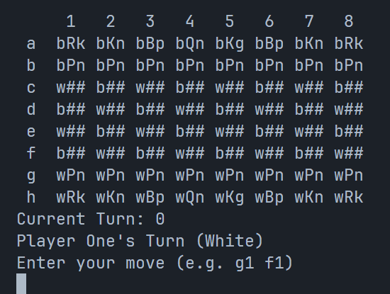

## Java Warriors
### CS 3354
* Noah Sadeghi
* Erik Atwell
* Chris Osburn
* Ally Imperial

# Nightly
A branch designed for testing and experimenting before merging to stable. (Separated from experimental branch)

**Chess Codebase(s)**  
We currently have two codebases, the one in this branch, and the one that currently exists in both the main and experimental branch.  

The nightly codebase was created as a backup plan just in case our experimental branch isn't able to produce a functional chess game by our due date. The initial code that Noah started us off with wasn't as polished as it should have been and put us in a tiny state of unorganization.

**Progress**  
The version of chess we have in this branch contains a working chess game, however it lacks some basic/optional functionality such as:
* **Priority: HIGH**
  * Stalemates *(Required)*
* **Priority: Low**
  * Promotions *(Optional)*
  * Castling *(Optional)*
  * JavaDoc comments *(Required)*
  * More comments explaining the code. *(Required)*

**Preview (screenshot)**  

